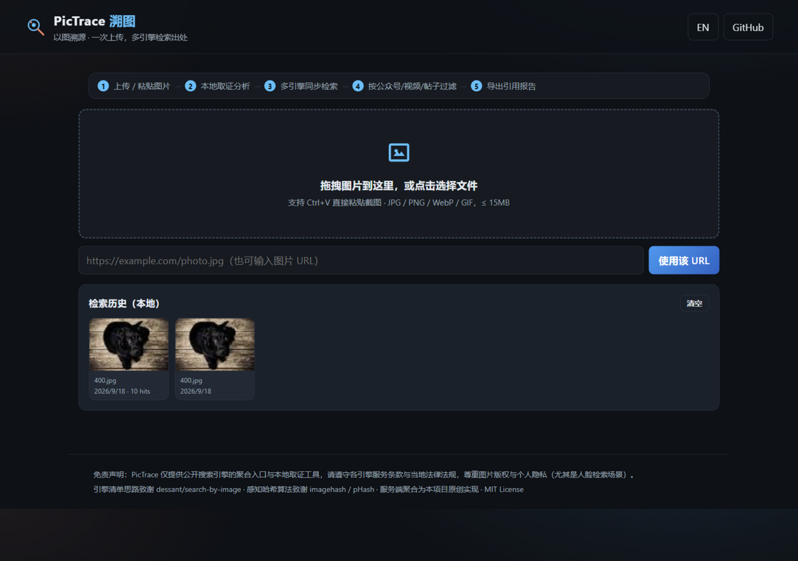
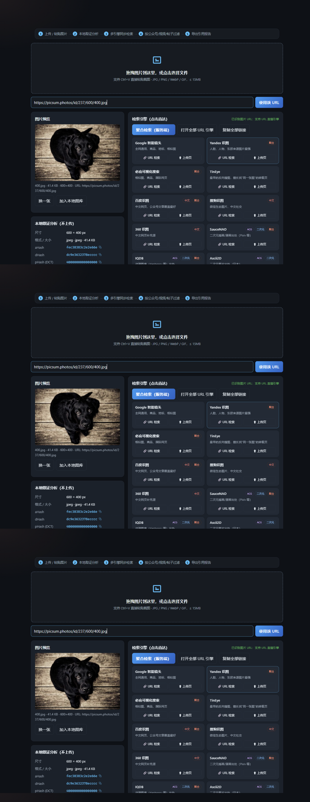
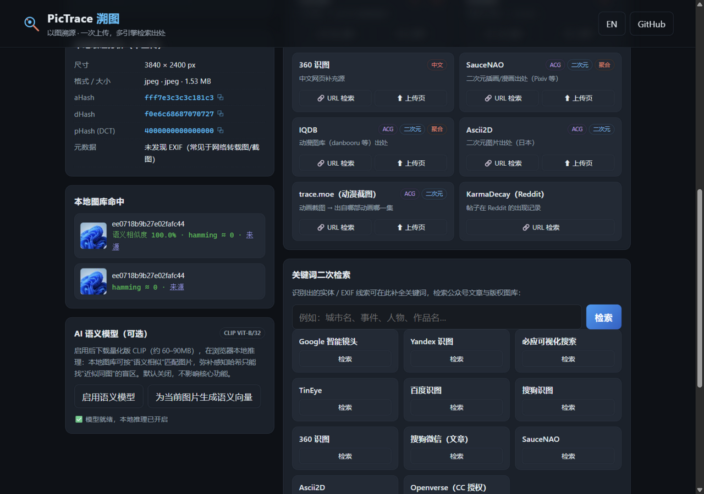
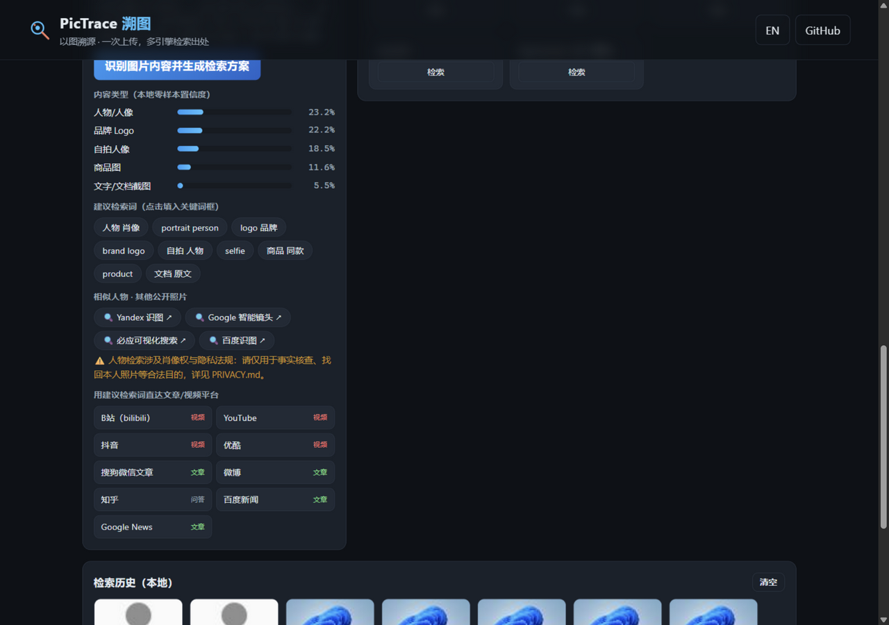
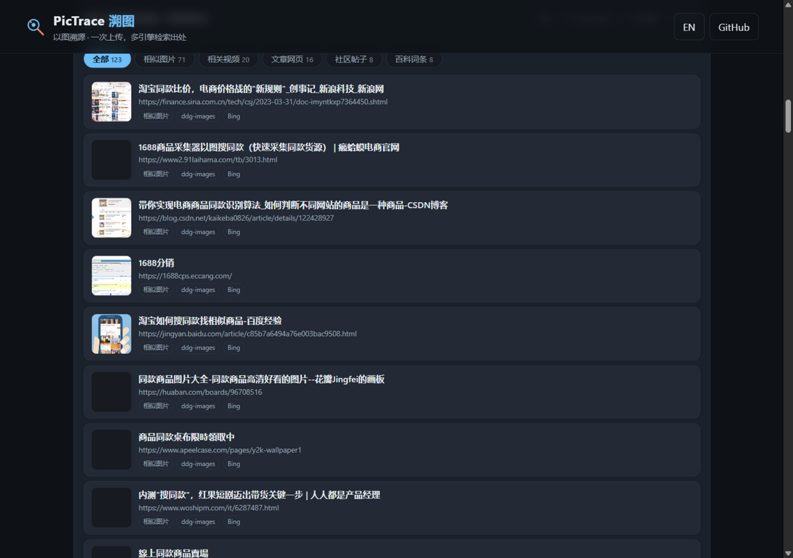
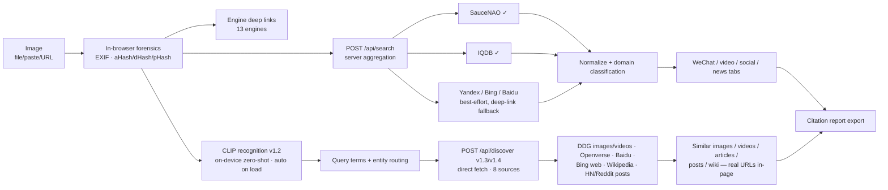

# PicTrace

**An open-source reverse-image provenance search aggregator — upload an image, find where it appears across public articles, posts and videos.**

[](LICENSE)
[](package.json)
[](package.json)

> 中文文档：[README.md](README.md)

## What it does

Given an image (local file, pasted screenshot, or URL), PicTrace answers: **"Where else does this image appear?"**

- 🖼️ **13 engines, one upload** — Google Lens, Yandex, Bing Visual Search, TinEye, Baidu Graph, Sogou, 360, SauceNAO, IQDB, Ascii2D, trace.moe, Sogou-WeChat articles, Openverse (link liveness verified — see the [verification log](docs/verification-log.md))
- 🔬 **Local forensics (nothing uploaded)** — EXIF camera/GPS/software metadata, perceptual hashes (aHash / dHash / pHash-DCT)
- 🤖 **Server-side aggregation** — the server submits the image to engines and parses results (SauceNAO / IQDB verified working; Yandex / Bing / Baidu degrade gracefully to deep links when anti-bot measures kick in)
- 🏷️ **Auto-classified results** — grouped by WeChat official-account articles (`mp.weixin.qq.com`), video, social posts, and news
- 🧠 **Content recognition (v1.2)** — on-device CLIP zero-shot classification (22 curated content prompts) recognizes the content type (person/animal/landmark/anime/product…), generates bilingual query terms, and routes to the engines best at "similar people / objects / scenes"
- 🎯 **Similar-content direct results (v1.3/v1.4) — the main flow, zero clicks** — **loading an image auto-fetches and shows real URLs directly in the page**, no aggregator sites needed: similar images (DuckDuckGo/Openverse/Baidu), **related videos (real bilibili/YouTube/Douyin links with durations)**, articles (Bing decoded), **community posts (Hacker News/Reddit with points & authors)** and wiki entries — 8 keyless sources fetched in parallel; engine deep links are folded into an "Advanced" section for manual verification only
- 📚 **Citation report export** — Markdown provenance report with retrieval timestamps, hashes, hit links and direct-result entries
- 🗃️ **Local library dedup** — IndexedDB image library with hamming-distance + optional CLIP semantic matching
- 🌐 Bilingual UI (中文 / English), dark forensic theme, zero frameworks, zero build, zero npm dependencies

| Home | Workbench + aggregated results | Semantic model (v1.1) | Recognition (v1.2) | Direct results (v1.3) |
| --- | --- | --- | --- | --- |
|  |  |  |  |  |

## Quick start

```bash
git clone https://github.com/xiaoanping-101/pictrace.git
cd pictrace
node server.js    # Node >= 18, no dependencies to install
```

Open <http://127.0.0.1:4173>.

Optional environment variables:

| Variable | Effect |
| --- | --- |
| `PORT` | Listen port (default 4173) |
| `PICTRACE_FETCH=0` | Disable server-side fetching (static + deep-link mode) |
| `NODE_USE_ENV_PROXY=1` + `HTTPS_PROXY=…` | Node ≥ 24 built-in: route server outbound requests through a proxy |

## Models used

PicTrace's models sit in three layers:

1. **Built-in algorithmic models (zero-dependency core, on-device)** — aHash / dHash / pHash (DCT-II) perceptual hashing with hamming-distance matching (after [imagehash](https://github.com/JohannesBuchner/imagehash) / [pHash](https://www.phash.org/)), EXIF/TIFF/PNG metadata parsing, and an original heuristic domain classifier. The core deliberately ships **no neural network**: millisecond on-device analysis, no model download, absolute privacy.
2. **Optional deep-learning model (v1.1, off by default)** — **CLIP ViT-B/32** (`Xenova/clip-vit-base-patch32`, q8) via [transformers.js](https://github.com/huggingface/transformers.js) v3, running fully in-browser (WebGPU/WASM). Adds semantic-similarity matching (cosine ≥ 0.75) for the local IndexedDB library, covering the blind spot of hash-only matching. The runtime is lazy-imported from CDN (jsdelivr → npmmirror → unpkg); model weights are routed through the local server's `/api/hf/*` passthrough to hf-mirror.com (China-friendly) when available, falling back to direct browser access on static hosting. Nothing loads until the user clicks *Enable semantic model*.
3. **External engine-side AI models (invoked, not bundled)** — Google Lens, Yandex CBIR, Bing Visual Search, Baidu Graph, SauceNAO etc. run their own models on their servers; PicTrace only calls their public endpoints via deep links or server-side aggregation and never redistributes their models.

See [README.md](README.md) for the CLIP inference flowchart and the full model table.

## How it works



See [README.md](README.md) for the full sequence diagram, hash-matching diagram, comparison with prior art, API reference, and citation guidance.

## Why this project

A pre-release survey of the GitHub `reverse-image-search` topic ([research report](docs/research.md)) found mature extensions ([dessant/search-by-image](https://github.com/dessant/search-by-image), [SmartImage](https://github.com/Decimation/SmartImage)) and a closed-source web aggregator (imgops.com) — but no open-source, no-install **web** aggregator with Chinese engine coverage, WeChat/video result filtering, forensic hashing, and citation-ready reporting. That combination is PicTrace's niche.

## License

[MIT](LICENSE) © 2026 xiaoanping-101
