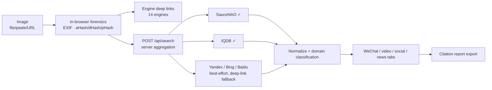

# PicTrace

**An open-source reverse-image provenance search aggregator — upload an image, find where it appears across public articles, posts and videos.**

[](LICENSE)
[](package.json)
[](package.json)

> 中文文档：[README.md](README.md)

## What it does

Given an image (local file, pasted screenshot, or URL), PicTrace answers: **"Where else does this image appear?"**

- 🖼️ **14 engines, one upload** — Google Lens, Yandex, Bing Visual Search, TinEye, Baidu Graph, Sogou, 360, SauceNAO, IQDB, Ascii2D, trace.moe, Sogou-WeChat articles, Openverse, KarmaDecay
- 🔬 **Local forensics (nothing uploaded)** — EXIF camera/GPS/software metadata, perceptual hashes (aHash / dHash / pHash-DCT)
- 🤖 **Server-side aggregation** — the server submits the image to engines and parses results (SauceNAO / IQDB verified working; Yandex / Bing / Baidu degrade gracefully to deep links when anti-bot measures kick in)
- 🏷️ **Auto-classified results** — grouped by WeChat official-account articles (`mp.weixin.qq.com`), video, social posts, and news
- 📚 **Citation report export** — Markdown provenance report with retrieval timestamps, hashes and hit links
- 🗃️ **Local library dedup** — IndexedDB image library with hamming-distance matching
- 🌐 Bilingual UI (中文 / English), dark forensic theme, zero frameworks, zero build, zero npm dependencies

| Home | Workbench + aggregated results |
| --- | --- |
|  |  |

## Quick start

```bash
git clone https://github.com/xiaoanping-101/pictrace.git
cd pictrace
node server.js    # Node >= 18, no dependencies to install
```

Open <http://127.0.0.1:4173>.

Optional environment variables:

| Variable | Effect |
| --- | --- |
| `PORT` | Listen port (default 4173) |
| `PICTRACE_FETCH=0` | Disable server-side fetching (static + deep-link mode) |
| `NODE_USE_ENV_PROXY=1` + `HTTPS_PROXY=…` | Node ≥ 24 built-in: route server outbound requests through a proxy |

## How it works



See [README.md](README.md) for the full sequence diagram, hash-matching diagram, comparison with prior art, API reference, and citation guidance.

## Why this project

A pre-release survey of the GitHub `reverse-image-search` topic ([research report](docs/research.md)) found mature extensions ([dessant/search-by-image](https://github.com/dessant/search-by-image), [SmartImage](https://github.com/Decimation/SmartImage)) and a closed-source web aggregator (imgops.com) — but no open-source, no-install **web** aggregator with Chinese engine coverage, WeChat/video result filtering, forensic hashing, and citation-ready reporting. That combination is PicTrace's niche.

## License

[MIT](LICENSE) © 2026 xiaoanping-101
