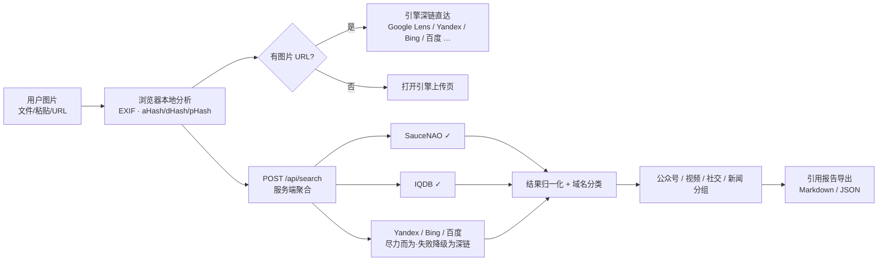
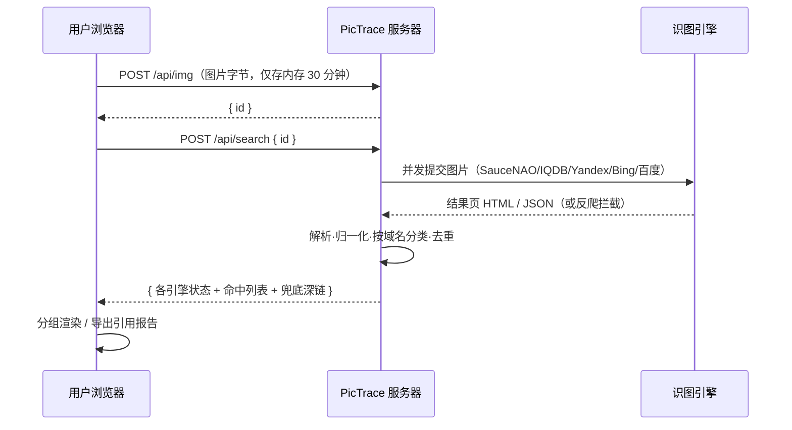
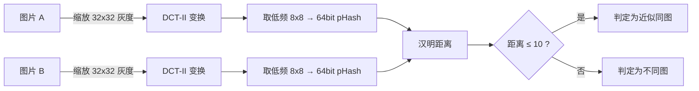
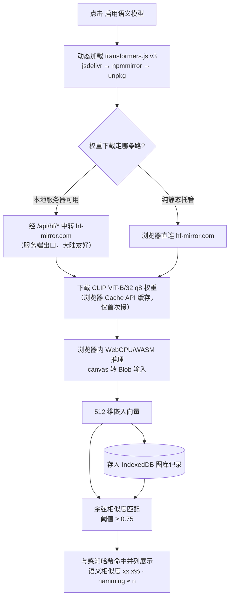

# PicTrace 溯图

**开源"以图溯源"检索平台 —— 上传一张图片，定位它出现在公众号文章、帖子、视频等公开网络中的出处链接。**

[](LICENSE)
[](package.json)
[](package.json)
[](CONTRIBUTING.md)

> English documentation: [README.en.md](README.en.md)

---

## 这是什么

给定一张图片（本地文件、截图粘贴或图片 URL），PicTrace 帮你回答：**"这张图最早/还出现在哪里？"**

- 🖼️ **一次载入，14 个识图引擎同步直达**：Google Lens、Yandex、Bing 可视化搜索、TinEye、百度识图、搜狗识图、360 识图、SauceNAO、IQDB、Ascii2D、trace.moe、搜狗微信文章、Openverse、KarmaDecay
- 🔬 **本地取证分析（不上传）**：EXIF 相机/GPS/软件元数据、感知哈希（aHash / dHash / pHash-DCT）
- 🤖 **服务端聚合检索**：服务器代为向引擎提交图片并解析结果（SauceNAO / IQDB 实测可用；Yandex / Bing / 百度受反爬限制时自动降级为深链）
- 🏷️ **结果自动分类**：按 **公众号文章（mp.weixin.qq.com）/ 视频 / 社交帖子 / 新闻媒体** 分组过滤
- 📚 **引用报告导出**：一键生成含检索时间、哈希、命中链接的 Markdown 溯源报告，条目按 GB/T 7714 顺序编码格式要点生成
- 🗃️ **本地图库查重**：图片加入 IndexedDB 图库后，用汉明距离自动匹配近似图；v1.1 起可启用 **CLIP ViT-B/32 本地语义模型**（transformers.js，浏览器内推理），按语义相似度匹配图片
- 🌐 **中英双语界面**，深色取证风，无框架、无构建、零 npm 依赖

| 首页 | 工作台 + 聚合结果 | 语义模型与图库匹配（v1.1） |
| --- | --- | --- |
|  |  |  |

> 截图为真实运行画面：右侧聚合结果中的 "Dog Loves You More Than He Loves Himself (55.51%)" 即 SauceNAO 对测试图片返回的真实出处。

## 快速开始

```bash
git clone https://github.com/xiaoanping-101/pictrace.git
cd pictrace
node server.js          # 需 Node >= 18，无任何依赖需要安装
```

浏览器打开 <http://127.0.0.1:4173>。

**可选环境变量：**

| 变量 | 作用 |
| --- | --- |
| `PORT` | 监听端口（默认 4173） |
| `PICTRACE_FETCH=0` | 关闭服务端聚合抓取，纯静态 + 深链模式 |
| `NODE_USE_ENV_PROXY=1` + `HTTPS_PROXY=http://127.0.0.1:7897` | Node ≥ 24 内置：让服务端出站请求走代理（中国大陆访问 Google/Yandex 等国际引擎时需要） |

**部署：** 任何能跑 Node 的环境均可（Render / Railway / Fly.io / VPS / NAS）。`public/` 也可单独托管为纯静态版（本地取证与引擎深链仍可用，仅无服务端聚合）。

## 工作原理

### 总体架构



### 检索时序（以聚合检索为例）



### 感知哈希比对原理



## 运用的模型（Models Used）

PicTrace 的模型分为三层：**内置算法模型（本地）**、**可选深度学习模型（本地）**、**依托的外部引擎 AI 模型（调用不内置）**。

### 1. 内置算法模型（零依赖核心，纯本地）

| 模块 | 算法/模型 | 出处与致谢 |
| --- | --- | --- |
| 感知哈希 | aHash（均值哈希）、dHash（梯度哈希）、pHash（DCT-II 低频系数中位数二值化，64bit） | [imagehash](https://github.com/JohannesBuchner/imagehash)（BSD-2）、[pHash.org](https://www.phash.org/)、Krawetz (2013) |
| 近似图判定 | 汉明距离 ≤ 10（pHash/dHash 双指标取最小） | 同上 |
| 元数据解析 | JPEG APP1(TIFF IFD0/Exif/GPS)、PNG tEXt/iTXt | EXIF 2.3（CIPA DC-008）、PNG ISO/IEC 15948 |
| 结果分类 | 域名启发式分类器（公众号/视频/社交/新闻） | 本项目原创 |

**设计决策**：核心功能不引入神经网络——感知哈希 + EXIF 在浏览器内毫秒级完成、无模型下载、隐私绝对可控，且对"找同一张图的转载"这一主场景已足够。

### 2. 可选深度学习模型：CLIP ViT-B/32（v1.1 新增，默认关闭）

为弥补感知哈希只能匹配"近似同图"、无法匹配"语义相关图"的盲区，v1.1 起提供可选的本地语义模型：

| 项 | 说明 |
| --- | --- |
| 模型 | **CLIP ViT-B/32**（`Xenova/clip-vit-base-patch32`，q8 量化，约 60–90MB） |
| 原作者 | OpenAI（*Learning Transferable Visual Models From Natural Language Supervision*, ICML 2021）；transformers.js 移植版来自 [Xenova](https://github.com/xenova/transformers.js) |
| 运行时 | [transformers.js](https://github.com/huggingface/transformers.js) v3，浏览器内 WebGPU/WASM 推理，**图片不离开本机** |
| 用途 | 为本地图库图片生成 512 维归一化视觉嵌入；以余弦相似度（≥ 0.75 阈值）做语义匹配，与感知哈希结果并列展示 |
| 加载策略 | 点击"启用语义模型"后才动态 import CDN 运行时（jsdelivr → npmmirror → unpkg 回退）；模型权重优先经本地服务器 `/api/hf/*` 中转 hf-mirror.com（大陆网络友好，服务端出口可靠），纯静态托管时回退浏览器直连镜像站；权重由浏览器 Cache API 缓存，仅首次下载较慢；任何失败不影响核心功能 |



### 3. 依托的外部 AI 模型（引擎侧，本项目仅调用其公开服务）

| 引擎 | 其模型能力（由引擎方运营，商标归各自所有者） |
| --- | --- |
| Google Lens | 大规模视觉识别/知识图谱匹配 |
| Yandex Images | CBIR 以图搜图索引（人脸/场景较强） |
| Bing Visual Search | 视觉相似检索 |
| 百度识图 | 图谱化视觉搜索（中文网页/公众号覆盖好） |
| SauceNAO | 深度索引聚合（动漫图库、DeviantArt 等） |
| IQDB / Ascii2D / trace.moe | 图库聚合检索 / 动画帧匹配 |

> 边界说明：以上引擎的 AI 能力运行在它们的服务器上；PicTrace 通过深链或服务端聚合调用其公开入口，**不分发、不修改其模型**。

## 为什么做这个项目（与同类开源的差异）

发布前我们调研了 GitHub 上 186 个 `reverse-image-search` 主题项目（详见[调研报告](docs/research.md)）：

| 项目 | 形态 | 与 PicTrace 的差异 |
| --- | --- | --- |
| [dessant/search-by-image](https://github.com/dessant/search-by-image)（3.7k★，GPL-3.0） | 浏览器扩展 | PicTrace 借鉴其**引擎注册表思想**，但无需安装扩展、开箱即用，并增加本地取证 / 结果分类 / 引用报告 |
| [Decimation/SmartImage](https://github.com/Decimation/SmartImage)（1.3k★） | 浏览器扩展 | 同上 |
| imgops.com | 网页聚合器（**闭源**） | PicTrace 是其**开源替代**，并扩展了中文引擎与取证能力 |
| [4evergr8/FlutterPicOrigin](https://github.com/4evergr8/FlutterPicOrigin) | 移动 App | PicTrace 面向桌面浏览器工作流 |
| [xemle/home-gallery](https://github.com/xemle/home-gallery)（1.2k★） | 自托管照片库 | PicTrace 借鉴其**本地感知哈希匹配**思想，做成轻量 IndexedDB 图库 |

**结论：多引擎"以图搜图"聚合已有成熟实践，但"开箱即用的网页版 + 中文引擎 + 公众号/视频结果过滤 + 取证哈希 + 引用报告"的组合尚无开源实现 —— 这就是 PicTrace 的定位。**

## 关于微信公众号 / 视频出处的说明

微信生态不开放图片反查 API，PicTrace 用三条现实路径逼近这一目标：

1. **百度识图 / Yandex 深链**：它们的索引包含 `mp.weixin.qq.com` 页面图片，命中后由 PicTrace 的域名分类器自动归入"公众号文章"组；
2. **搜狗微信文章检索**：以图片线索（EXIF、实体关键词）做文章库二次检索；
3. **服务端聚合**：可抓取引擎的结果会被解析并按 `mp.weixin.qq.com`、`bilibili.com`、`weibo.com` 等域名自动分组。

## 引用规范（How to Cite）

在论文、报道或调查报告中使用 PicTrace 生成的结果时，请：

1. **引用命中页面本身**（检索工具只是线索，证据是页面），格式示例（GB/T 7714-2015）：
   > [1] 作者. 题名[EB/OL]. (发布日期)[引用日期]. https://example.com/page.
2. **注明检索工具与时间**，如：
   > 图片出处经 PicTrace（https://github.com/xiaoanping-101/pictrace）于 2026-09-18 检索确认。
3. 导出的 Markdown 报告已按上述要点预生成条目，正式引用前请按目标出版物规范复核。
4. 引用本软件本身（BibTeX，另见 [CITATION.cff](CITATION.cff)）：

```bibtex
@software{pictrace2026,
  author  = {xiaoanping-101},
  title   = {PicTrace: Open-source Reverse Image Provenance Search Aggregator},
  year    = {2026},
  url     = {https://github.com/xiaoanping-101/pictrace},
  version = {1.0.0},
  license = {MIT}
}
```

## API

| 端点 | 方法 | 说明 |
| --- | --- | --- |
| `/api/health` | GET | 健康检查（含聚合开关状态） |
| `/api/img` | POST | 原始图片字节体 → `{id}`（内存保存 30 分钟） |
| `/api/search` | POST | `{id 或 url, engines?}` → 各引擎状态与命中列表 |
| `/api/proxy?url=` | GET | 图片代理（供前端跨域取证） |
| `/api/hf/*` | GET | 模型权重中转（hf-mirror.com，供 CLIP 模块，大陆网络友好） |
| `/img/:id` | GET | 取回已上传图片 |

## 隐私与合规

- 本地取证（EXIF / 哈希 / 图库 / 历史）**全部在浏览器内完成**，不离开你的设备；
- 服务端聚合模式下图片仅存于服务器**内存**，30 分钟后自动消失，不落盘、不记录；
- 请遵守各引擎服务条款；人脸检索场景请额外注意肖像权与隐私法规（详见 [PRIVACY.md](PRIVACY.md)）。

## 项目结构

```
pictrace/
├── server.js              # 零依赖 Node 服务器（静态托管 + 聚合提供器）
├── public/
│   ├── index.html         # 单页界面（无框架）
│   ├── app.js             # 前端主逻辑（i18n/取证/聚合/图库/历史/报告）
│   ├── engines.js         # 引擎注册表（前后端共享）
│   ├── style.css
│   └── lib/
│       ├── imghash.js     # aHash / dHash / pHash(DCT)
│       ├── exif.js        # JPEG EXIF / PNG tEXt 精简解析器
│       └── clip.js        # 可选 CLIP ViT-B/32 本地语义模型（transformers.js 按需加载）
├── docs/
│   ├── research.md        # 同类项目调研报告
│   ├── citation-guide.md  # 引用规范详解
│   └── screenshots/       # 运行截图
├── CITATION.cff           # GitHub 原生引用格式
├── CONTRIBUTING.md
├── PRIVACY.md
└── LICENSE                # MIT
```

## 致谢（Acknowledgements）

本项目的开发站在以下开源工作之上（详见[调研报告](docs/research.md)）：

- **[dessant/search-by-image](https://github.com/dessant/search-by-image)**（GPL-3.0）— 引擎清单与 URL 模板的参考来源；
- **[JohannesBuchner/imagehash](https://github.com/JohannesBuchner/imagehash)**（BSD-2）与 **[pHash](https://www.phash.org/)** — 感知哈希算法思想；
- **[xemle/home-gallery](https://github.com/xemle/home-gallery)** — 本地图片库感知哈希匹配的实践参考；
- 各识图引擎的公开服务（商标归各自所有，本项目与它们无隶属关系）。

服务端聚合提供器、域名分类器、取证前端与引用报告为本项目原创实现。

## 版本历史

见 [CHANGELOG.md](CHANGELOG.md)。

## License

[MIT](LICENSE) © 2026 xiaoanping-101
